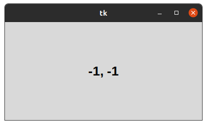
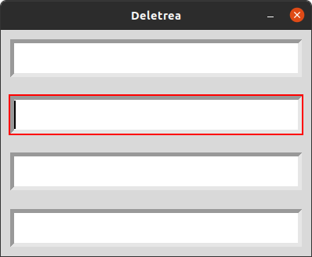
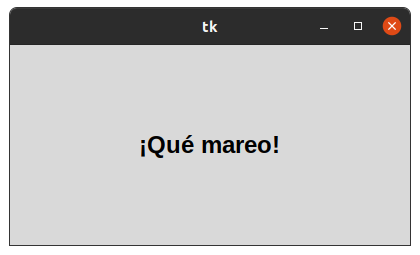

# 2.  METODOS COMUNES

## Posicionamiento de ratón

### Este gestor nos ayudar a ver en que coordenada esta ubicada el cursor

## Temporizador 

### Este gestor consiste en deletrear una palabra o letra con mayor velocidad o menos velocidad 

## foco

### Este gestor agranda la palabra y la empequeña 

