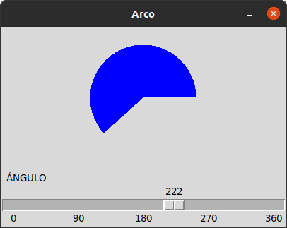
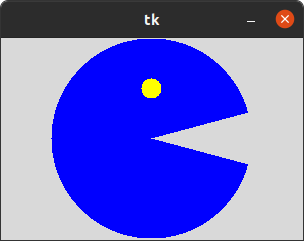
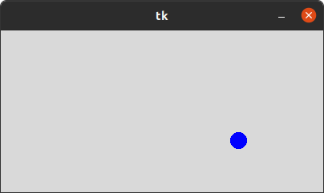
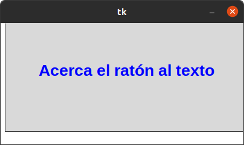
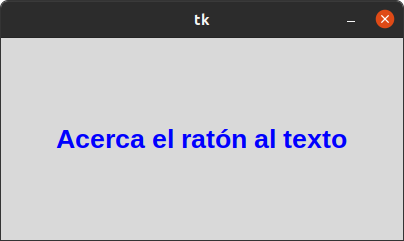
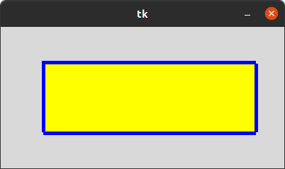

# 5. CANVAS

# Angulo

## Hace el circulo dependiendo del angulo

# Arco 

## ESte gestor hace un circulo como un personaje del juego "pacman"

# Circulo 

## Este gestor hace que una pelota rebote en la pantallacom tipo "ping pong"

# Imagen 

## Este gestor hace que cualquier imagen  flote en la pantalla

# cuadricula 

## Este gestor crea una cuadricula con las lines que desee

# poligono 

## Este gestor hace un poligono en la pantalla 

# raton

## Este gestor hace que al cursor toca el texto cambie de color 

# rectangulo

## Este gestor coloca un rectangulo en la pantalla

