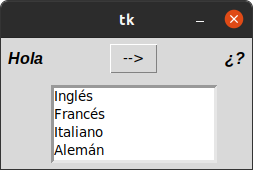
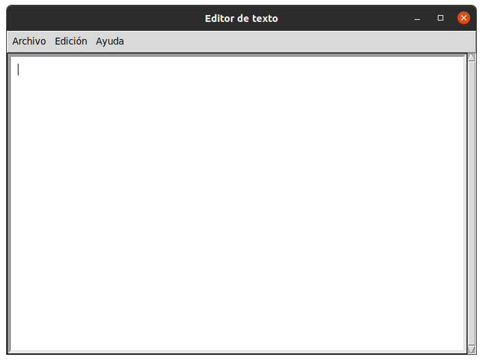
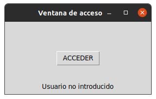

# 5. WIDGETS

## Tiempo

### Este gestor calcula el tiempo desde que se inicia hasta que alguien lo detenga

## Registro

### Este gestor hace una interfas de registro 

## Tiempo

### Este gestor muestra la hora en tiempo real

##  Idiomas

### Este gestor cambia la palabra "HOLA" a 4 idiomas distintos

## Menú

### Este gestor crea una interfaz de un menú

## Formulario

## Este gestor hace una interfaz de un formulario

## messagebox

## Este gestor crea un menu

## Encuesta

## Este gestor crea uan interfaz de un formulario

## angulo

### Este gestor hace la forma del angulo

## editor de texto

### este gestor crea un editor de texto para poder escribir en esa interfaz

## formulario

### Este gestor crea una interfaz de un formulario

## acceder

## Esre gesttor crea una interfaz de inicio de seccion

